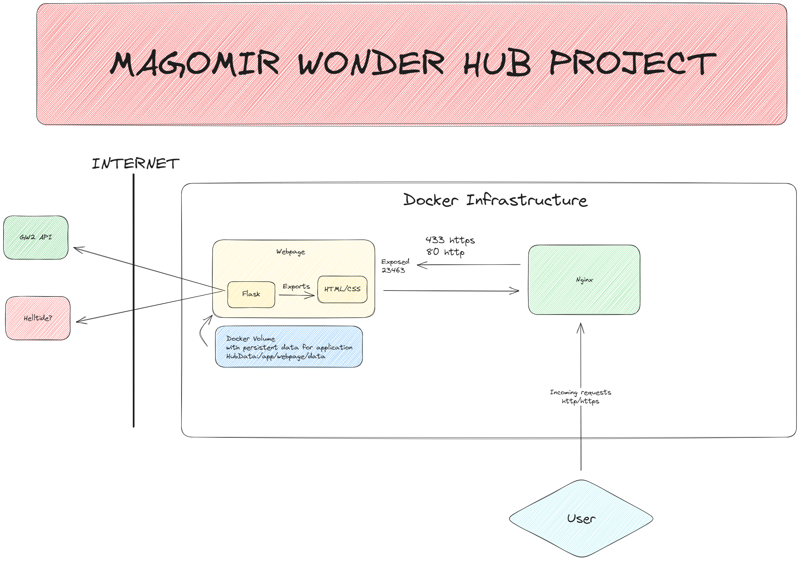

# Magomir Wonder Hub

My utility website for my convinience :>

## Current state of infrastructure and design

## Things I have used in this project

- [x] Basic HTML/CSS
- [x] Python
- [x] External REST API usage (GW2 api, more later one)
- [x] Midjourney
- [x] Flask (Python web framework)
- [x] JSON format for data storage and exchange
- [x] Docker (containerization)
- [x] nginx (web server for certificated https)
- [x] Docker-compose (for easy deployment)
- [ ] SQL database (for todo list)
